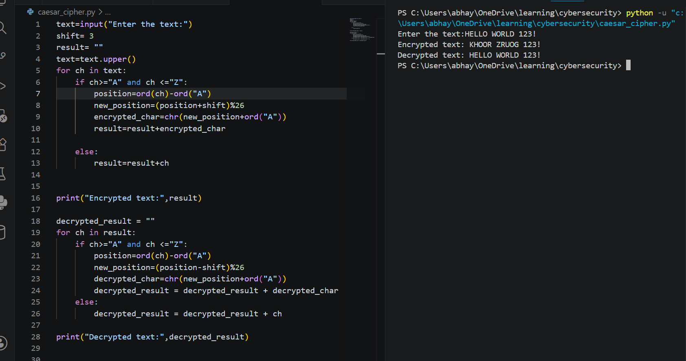

# Caesar Cipher Encryption & Decryption

## Description
This project implements a basic Caesar Cipher using Python. It encrypts user input using a shift of 3 and then decrypts the encrypted text back to the original message.

## Features
- Encrypts text using Caesar Cipher
- Decrypts encrypted text
- Uses `ord()` and `chr()`
- Uses modulo (`% 26`) for wrap-around
- Preserves spaces, numbers, and special characters

## Technologies Used
- Python 3

## Project Requirements
- Encrypt user text
- Decrypt encrypted text
- Display both encrypted and decrypted output

## Sample Output

### Example 1

**Input**
```
HELLO
```

**Output**
```
Encrypted text: KHOOR
Decrypted text: HELLO
```

### Example 2

**Input**
```
HELLO WORLD 123!
```

**Output**
```
Encrypted text: KHOOR ZRUOG 123!
Decrypted text: HELLO WORLD 123!
```

## Screenshots

### Program Output



## Author
Abhay B S


