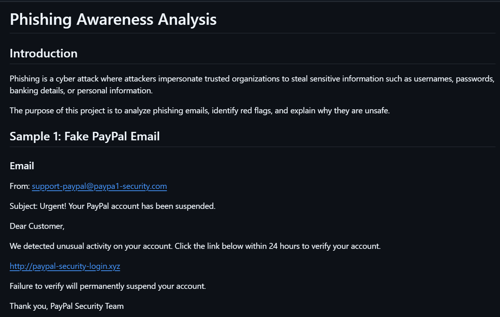
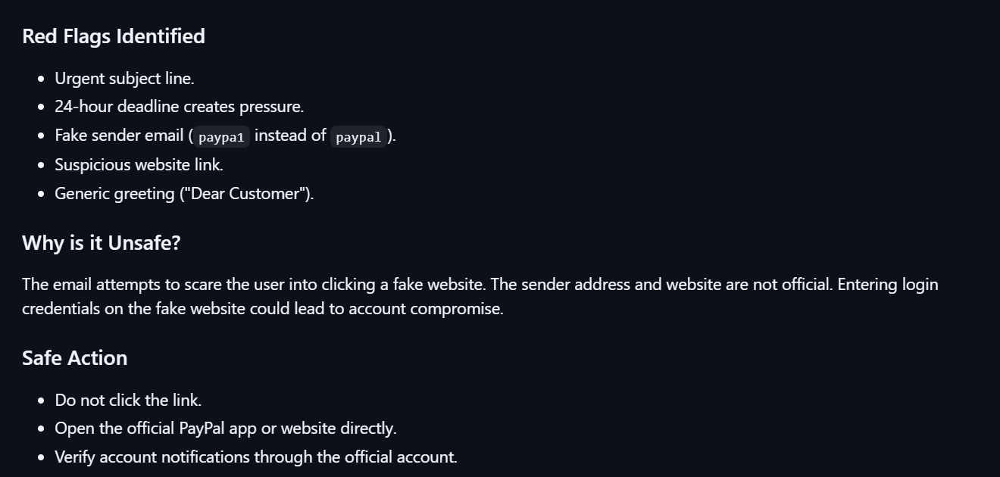
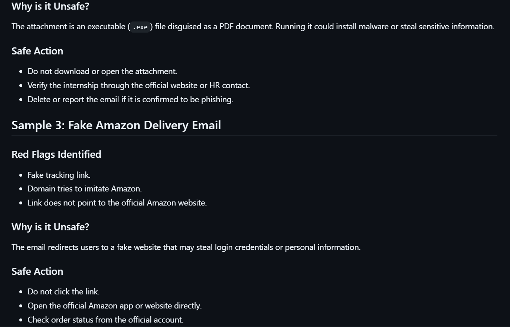

# Project 3 - Phishing Awareness Analysis

This project analyzes phishing emails by identifying suspicious links, red flags, and explaining why the messages are unsafe.

The objective is to improve phishing detection skills and cybersecurity awareness.

## Screenshots

### Analysis - Part 1

### Analysis - Part 2

### Analysis - Part 3

### Analysis - Part 4

### Analysis - Part 5

